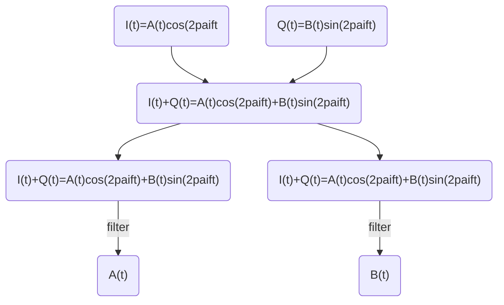

quadrature

```mermaid
flowchart TD
A("I(t)=A(t)cos(2paift")
B("Q(t)=B(t)sin(2paift)")
C("I(t)+Q(t)=A(t)cos(2paift)+B(t)sin(2paift)")
D("I(t)+Q(t)=A(t)cos(2paift)+B(t)sin(2paift)")
E("I(t)+Q(t)=A(t)cos(2paift)+B(t)sin(2paift)")
F("A(t)")
G("B(t)")

A-->C
B-->C
C-->D--filter-->F
C-->E--filter-->G
```

