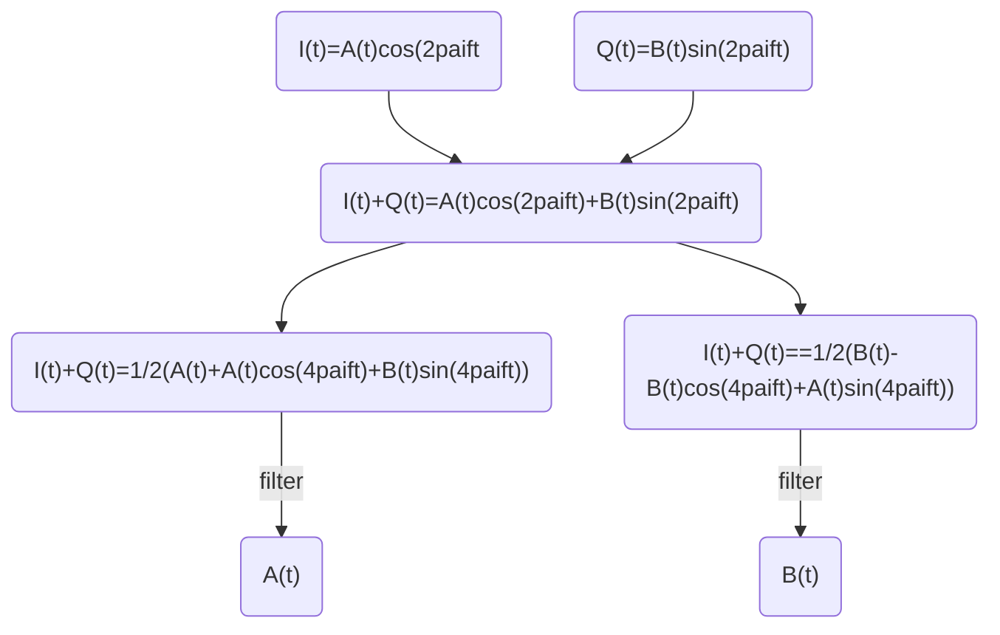

quadrature

```mermaid
flowchart TD
A("I(t)=A(t)cos(2paift")
B("Q(t)=B(t)sin(2paift)")
C("I(t)+Q(t)=A(t)cos(2paift)+B(t)sin(2paift)")
D("I(t)+Q(t)=1/2(A(t)+A(t)cos(4paift)+B(t)sin(4paift))")
E("I(t)+Q(t)==1/2(B(t)-B(t)cos(4paift)+A(t)sin(4paift))")
F("A(t)")
G("B(t)")

A-->C
B-->C
C-->D--filter-->F
C-->E--filter-->G
```

